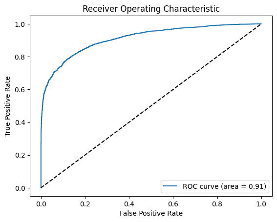
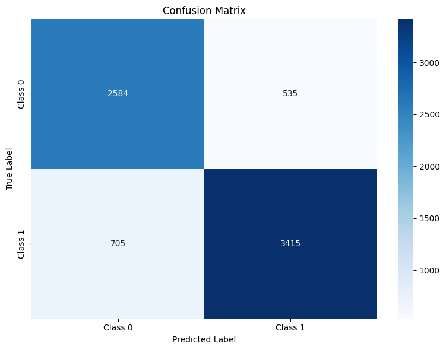

# Customer Churn Prediction for a Telecom Company

## Project Overview

This project aims to develop a predictive model for identifying the probability of customer churn in a telecom company. Using historical customer data, the project leverages exploratory data analysis (EDA), data preprocessing, and machine learning techniques to build an accurate churn prediction model.

## Features

**Exploratory Data Analysis (EDA):**
- Dataset Overview:
    - The project analyzes a dataset of over 70,000 unique customers from an internet service provider.
    - Includes customer-specific attributes such as subscription age, average bill amount, service failures, and download/upload speeds.
- Data Visualization:
    - Histograms for numeric variables (e.g., `subscription_age`, `bill_avg`) to understand their distribution.
    - Correlation heatmaps to identify relationships between features, such as `service_failure_count` and `churn`.
    - Bar plots for binary features like `is_tv_subscriber` and `is_movie_package_subscriber` to observe their impact on churn.
- Insights Derived:
    - Customers with higher `service_failure_count` show a strong likelihood of churning.
    - A longer `remaining_contract` correlates with reduced `churn` likelihood.
    - Excessive `download_over_limit` is a potential `churn` driver.
- Feature Importance:
    - The analysis highlights key predictors of `churn`, including `service_failure_count`, `remaining_contract`, and `bill_avg`.

**Data Preprocessing:**
- Processing Missing Values:
    - Columns like `remaining_contract`, `download_avg`, and `upload_avg` were analyzed.`remaining_contract`: Missing values (or zeros) are significant for churned customers, indicating potential removal due to contract termination. This column was dropped due to high missing rates (52.5%).`download_avg` and `upload_avg`: Outliers were identified, and missing values were replaced with the median for safety.
- Encoding Categorical Variables:
    - Binary variables (`is_tv_subscriber`, `is_movie_package_subscriber`) were found to be already binary, negating the need for additional encoding.
- Normalization of Features:
    - Standardization was applied to numerical features to ensure consistency in model input.

**Model Development:**
- **Models Tried**:
    - Logistic Regression
    - Decision Tree
    - Random Forest
    - Gradient Boosting
- **Gradient Boosting Performance**:
    - This model demonstrated the best performance among all tested models.
  - **Key Metrics:**
    - **Precision:** 0.83 on average, with better performance on the positive class.
    - **Recall:** 0.83 for both classes, reflecting balanced detection capability.
    - **F1-Score:** Strong average of 0.83, indicating reliability.
    - **ROC-AUC:** High value of 0.91, showing excellent class separation capability.
      
    - **Confusion Matrix:**
      
    - Gradient Boosting was chosen for its ability to capture complex patterns and deliver high precision and recall, making it ideal for real-world applications.

**Deployment:**
- **Dockerized Model**:
    - The project includes a Dockerized environment for easy deployment and reproducibility across different systems.
- **Streamlit App**:
    - A Streamlit web application is integrated into the project to provide an interactive interface for churn prediction.


## Technologies Used

- **Languages**: Python
- **Libraries**:
    - **Pandas, NumPy** for data manipulation.
    - **Matplotlib, Seaborn** for data visualization.
    - **Scikit-learn** for machine learning.
    - **Streamlit** For building an interactive web application to visualize data and make predictions
- **Tools**:
    - **Jupyter Notebook** for development and analysis.
    - **Git & GitHub** for version control and collaboration.
    - **Docker** for containerization.

## Installation

```bash
pip install poetry
poetry shell
poetry update
```
# https://projectgoit11.streamlit.app/

## Usage

...

## Repository Structure

```
├── internet_service_churn/       # Contains the dataset
├── notebooks/                    # Jupyter notebooks for analysis
│   ├── analysis_yuli.ipynb       # Exploratory Data Analysis
│   ├── Data_Preprocessing.ipynb  # Data preprocessing steps
│   └── Model_Training.ipynb      # Model development and evaluation
├── Dockerfile                    # Docker setup for containerization
├── docker-compose.yml            # Docker Compose file for easy deployment
├── requirements.txt              # Python dependencies
└── README.md                     # Project documentation
```

## Developed by
- [jamleston](https://github.com/jamleston)
- [Yuliia Chorna](https://github.com/YuliiaChorna1)
- [Anastasya](https://github.com/Anastasya2701)
- [Boar Artem](https://github.com/BoarArtem)
- [Zippozuzu](https://github.com/Zippozuzu)
- [A1Q137](https://github.com/A1Q137)
- [Karim](Karim)


